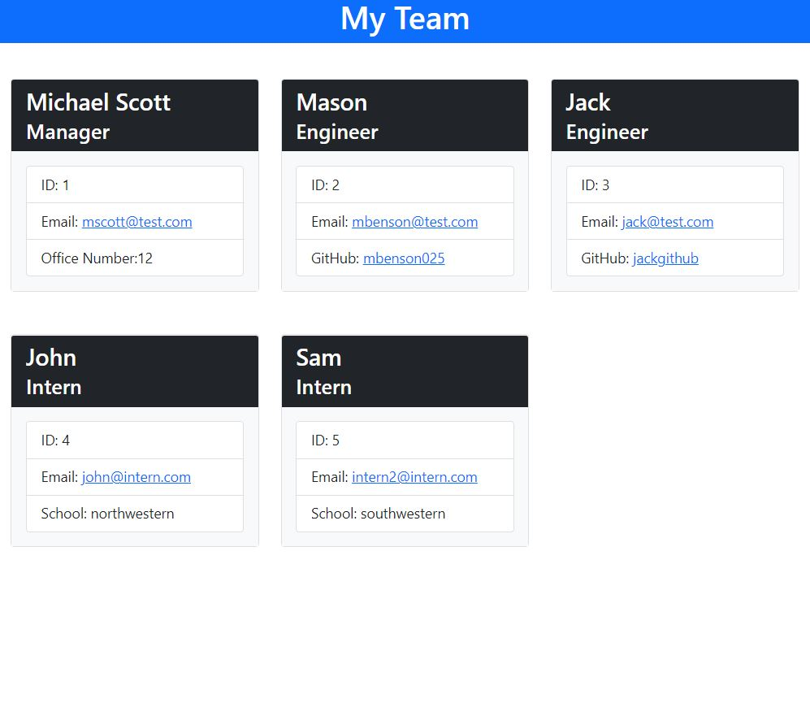
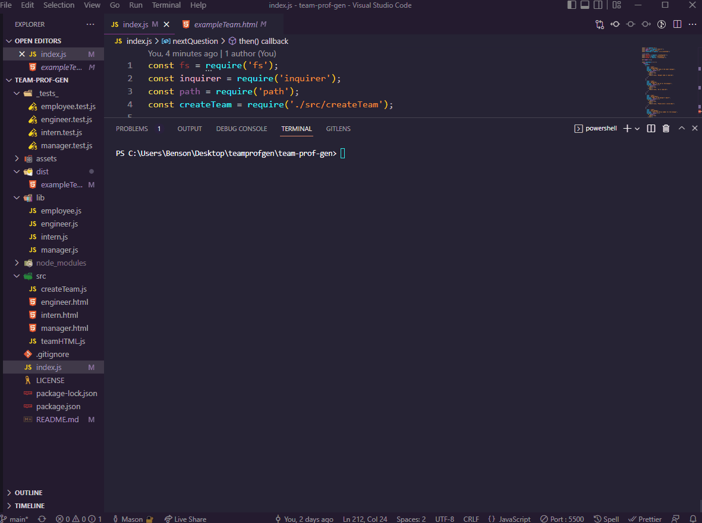
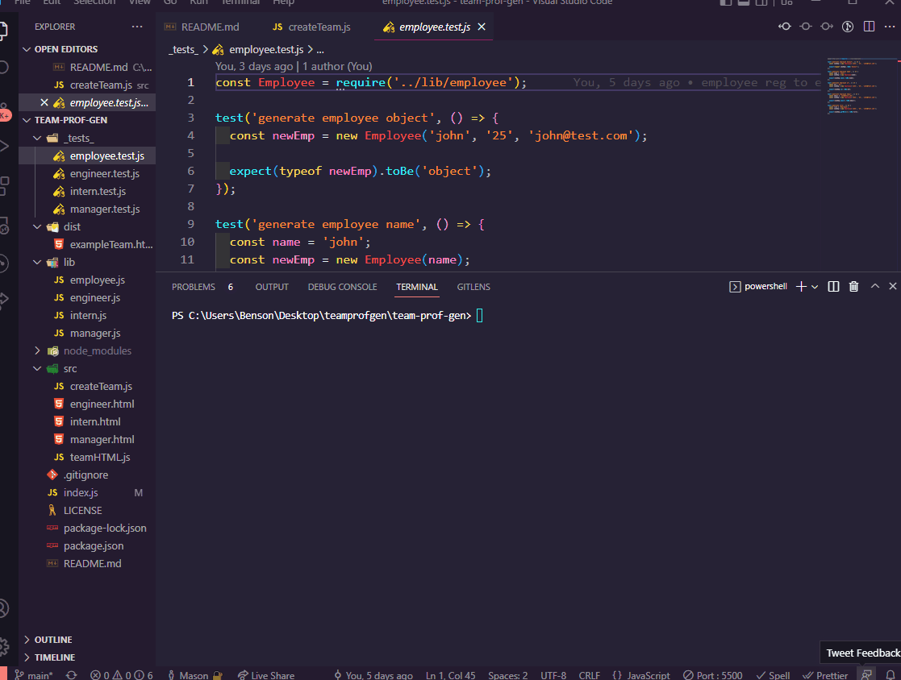

# Team Profile Generator


<br>

## Table of Contents

- [Description](#description)
- [Installation](#installation)
- [Usage](#usage)
- [Demo](#demo)
- [Tests](#tests)
- [Questions](#questions)
- [License](#license)

<br>

## Description

Command-line application using Node.js that generates a Team Profile page based on user input. The user is prompted to create a team with employees in the role of manager/engineer/intern.

Generated team example:



## Installation

Clone Github repo to device. Install node.js and download the inquirer package dependency using:

```
npm install
```

## Usage

Run the index.js file with the command-line:

```
node index
```

Answer the resulting questions to build your team.

## Demo



## Tests

Tests are run using [Jest](https://jestjs.io/). 4 test suites(located in _tests_ folder) are used to run 14 individual tests.

Documentation for Jest can be found [here](https://jestjs.io/docs/getting-started).

Demo of tests being run:



## Questions

Contact me here:

- [GitHub Profile](https://github.com/mbenson025)
- Email me at mbenson025@gmail.com

## License

MIT License

Copyright (c) 2022 Mason Benson

Licensed under the [MIT](LICENSE) license.
